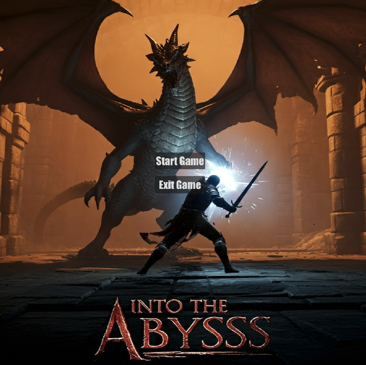
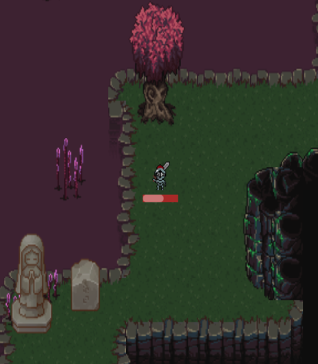
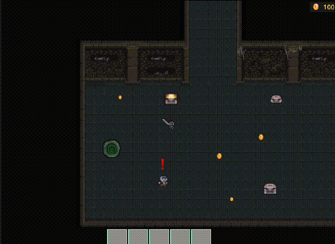
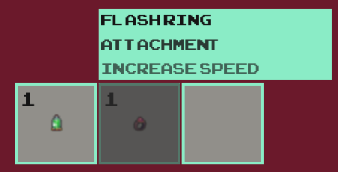
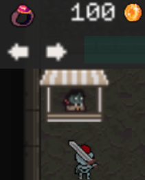

# 2D Dungeon Game

This project is a one-player 2D dungeon-crawling game built in Godot. Players explore a sketchy dungeon, defeat enemies, confront powerful bosses, and interact with various game mechanics like inventory, quests, and shops.

## Table of Contents

1. [Overview](#overview)
2. [Features](#features)
   - [Player](#player)
   - [Dungeon Map](#dungeon-map)
   - [Enemies & Bosses](#enemies--bosses)
   - [Inventory System (Hotbar) & Shop](#inventory-system-hotbar--shop)
   - [Storyboarding](#storyboarding)
   - [General Game Logic](#general-game-logic)
   - [Quests](#quests)
3. [Progress](#progress)
4. [Screenshots & Videos](#screenshots--videos)

## Overview

This game offers players a dungeon to explore, where they encounter various challenges, such as traps, enemies, and boss fights. Players must navigate through the dungeon, collect power-ups, solve puzzles, and progress through the story by defeating bosses.

## Features

### Player

- **Player Movement**: The player can move in all directions, bound within the map’s edges.

- [✅] Implement player movement
- [✅] Set player boundaries within the map
- [✅] Allow the player to use worm holes
- [✅] Allow the player to fall through trap holes

- **Player Attack**: Allows the player to engage enemies with a basic attack.
  - [✅] Develop basic attack animations
  - [✅] Add damage mechanics for player attacks

### Dungeon Map

- **Map Design**: The layout and design of the dungeon map.

  - [✅] Create initial dungeon map layout
  - [✅] Implement various rooms and corridors
  - [✅] Add interactive objects (e.g., chests, keys)

## Enemies & Bosses

### **Basic Enemies**: Skeletons and other non-boss enemies, including AI for movement and attacks.

- [✅] Create skeleton enemy models and animations
- [✅] Implement enemy AI for patrolling and attacking
- [✅] Integrate damage and defeat mechanics for enemies

### **Bosses**: More challenging enemies with special abilities.

- [✅] Design boss models and animations
- [✅] Implement boss-specific attack patterns
- [✅] Develop boss health bars and battle triggers

### Inventory System (Hotbar) & Shop

### **Hotbar**: Items can be added and used from the hotbar using keys 1–5.

- [✅] Items will stack if more than one of the same type is found.
- [✅] Items such as potions or power-ups can provide temporary boosts (e.g., increased speed).
- [✅] Items can be dragged, dropped, or used from the hotbar.

## **Shop**: Items can be purchased using in-game coins.

- [✅] Items available in the shop include potions, upgrades, and equipment.
- [✅] Items are categorized and stored within the shop for easy access.

- **Chests & Keys**: Keys of different types are required to open chests.
  - Chests include Boss, Golden, and Common types, each requiring a matching key.

### Storyboarding

- **Plot Events**: Display text plots during important moments.
  - [✅] Add plot text at the game start
  - [✅] Trigger plot updates upn quest completion
  - [✅] Show boss defeat text and game progression updates

### General Game Logic

- **Game Initialization & Menus**: Manage the start of the game and menu interactions.

  - [✅] Develop start menu and load game options
  - [✅] Implement pause menu and game-over screens

- **Health & Power-ups**: Items that aid the player on their journey.
  - [✅] Design health and stamina power-ups
  - [✅] Integrate power-ups into the game with item collection mechanics

### Quests

- **Quest Types**: Two main types of quests:

  - **Talk-to quests**: Players interact with NPCs to trigger events or progress.
  - **Collection quests**: Collect items or defeat enemies to complete objectives.

- **Quest Tracking**: Current quests are shown in the top-left of the screen and updated in the Quest Manager.
  - [✅] Quests update automatically when accepted or completed
  - [✅] Rewards are automatically given to the player in coins or items

### GUT Testing

- **Unit Testing**: Utilized the GUT (Godot Unit Testing) package to ensure consistent functionality.
  - Tests help identify bugs and prevent new features from breaking existing functionality.

### Open World Map

- The dungeon world map is built using a tilemap-based system, providing a dynamic environment with different rooms, corridors, traps, and interactive elements.

---
